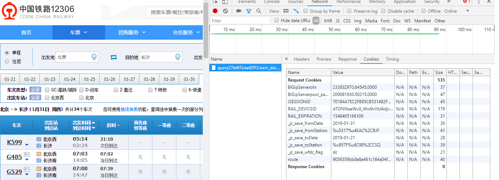

# robot_12306
抢票小程序

# 环境配置
chrome驱动-GoogleDriver

download对应操作系统版本
https://sites.google.com/a/chromium.org/chromedriver/downloads

window->驱动已解压至robot_12306/install->放入python Scripts目录下(python3.7)

mac->mv chromedriver /usr/local/bin

linux->mv chromedriver /usr/bin

# 参数配置
乘客信息配置->robot_12306/resources->/conf/passenger.conf

城市信息配置->robot_12306/resources->
get cookie->F12->network->cookie->始发站和目的地的cookie值获取->加入至/conf/city.conf

# 关于赞助
欢迎一起探讨学习新知识->
本着自愿原则进行赞赏

